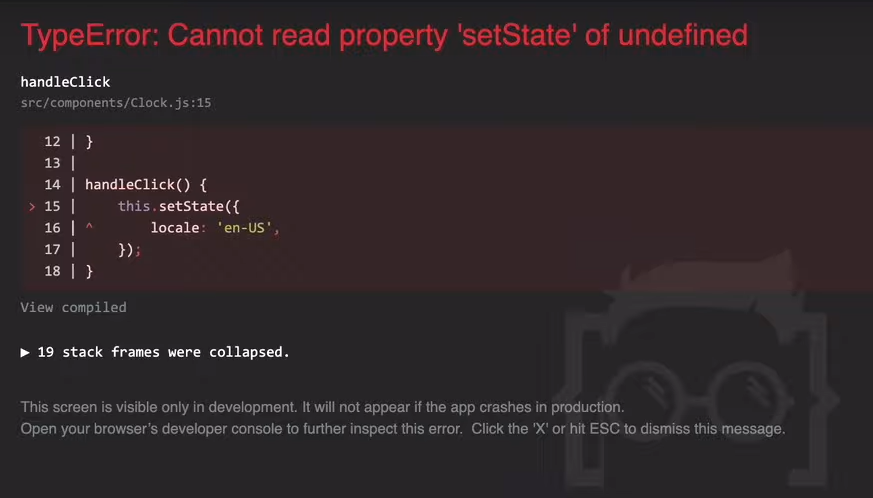

### ekta *button* rakhbo, eitai click korle *clock* er language *english* hobe


```js
class Clock extends React.Component {
    // state 
    
    // handleClick() {...}

    //render() {...}
}
```

```js
class Clock extends React.Component {
    
    state = 
    {
        date: new Date(),
        locale: 'bn-BD'
    };
}
```    

```js
class Clock extends React.Component {

    handleClick(locale) {
        this.setState({locale});
    };
}
```

```js
class Clock extends React.Component {

    render() {
        const {date, locale} = this.state;
        let time = date.toLocaleTimeString(locale);

        return (
            <div>
                <h1 className="heading">
                    <span className="text">{time}</span>
                </h1>

                <Button onClick={this.handleClick}>
                    Click here
                </Button>
            </div>
        );
    }
}
```

erokom obostha jodi code k run kori, ebong *button* tai click kori tokhn ei **error** ta dibe 



- it means *this.setState()* er **this** ta undefine.

- *handleClick(locale)* method er vitore this ta change hoye gese

- change takey thamanor jonno `arrow function` use kora lagbe


```js
class Clock extends React.Component {

    handleClick = (locale) => {
        this.setState({locale});
    };
}
```

---

## Passing Parameters

arrow function use kora lagbe, like this :

```js
<Button onClick={()=>this.handleClick('bn-BD')}>
    Click here
</Button>
```


