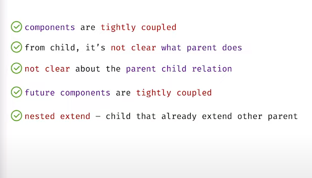

# Composition vs Inheritance

### React has a powerful *composition* model, and we recommend using **composition** instead of *inheritance* to reuse code between components.

---

### Problems of using *inheritance* :


---

```js
class Child extends Parent {
    // this class can use methods of Parent class
}
```

amra ei extend ta korbo na

rather amra, `Parent` class er j j method `Child` class er lagbe, shegula k `Parent` hote `Child` er kache **props** hishebe pathabo.

```js
const Child = (props) => {
    // 'props' k destructure kore jinish ber korbo
}
```

---

## React Doc:

```js
function FancyBorder(props) {
  return (
    <div>
      {props.children}
    </div>
  );
}
```

```js
function Dialog(props) {
  return (
    <FancyBorder color="blue">
      <h1 className="Dialog-title">
        {props.title}
      </h1>
      <p className="Dialog-message">
        {props.message}
      </p>
    </FancyBorder>
  );
}
```

```js
function WelcomeDialog() {
  return (
    <Dialog
      title="Welcome"
      message="Thank you for visiting our spacecraft!" />
  );
}
```
<br>

---

# **Task:** ekta *text* er shamne piche *emoji* add korte hobe

## App.js

```js
function App() {

    return (
        <div>   
            <Emoji>
                {(obj)=> <Text func = {obj.addEmoji}></Text>}
            </Emoji>

        </div>
    );
}
```
<u>Notes:</u> 
- amader target chilo *Text* component er kache *Emoji* component er `addEmoji()` method k pathano. 
- arrow func er *parameter* hishebe ja paisi (means `obj`) 
- amra shetak *Text* component er kache **props** hishebe pathaisi
- *Text* component er **props** er moddhe `func` namer jinish thakbe


---
## Emoji.js

```js
class Emoji extends Component {

    addEmoji = (txt, emoji) => `${emoji} ${txt} ${emoji}`;

    render() {
        return (
            <div>
                {this.props.children({addEmoji:this.addEmoji})}
            </div>
        );
    }
}
```

<u>Notes:</u> 
- *Emoji* comp er moddhe `this.props.children(obj)` diye amra bujhacchi j
    - *Emoji* comp er *children* hobe ekta *function*
    - *function* ta param hishebe ekta *object* nibe


---
## Text.js

```js
const Text = ({func}) => {
    const text = 'I am Composition';
    return (
        <div>
            {func ? func(text, '😁') : text}
        </div>
    );
};
```
<u>Notes:</u> 
- object destructure kore *func* takey *props* thike ber korlo
- *func* namer function k call diye dise
- ei *func* holo *Emoji* component er `addEmoji()` method ta.
