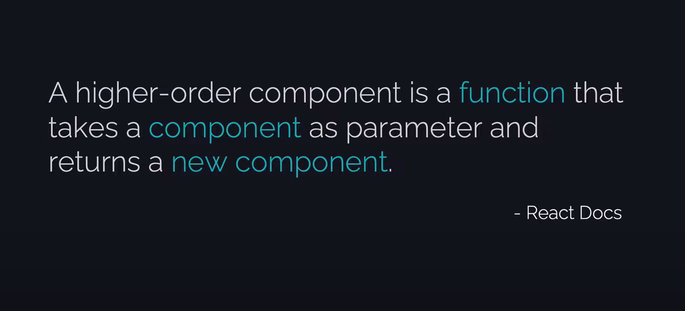
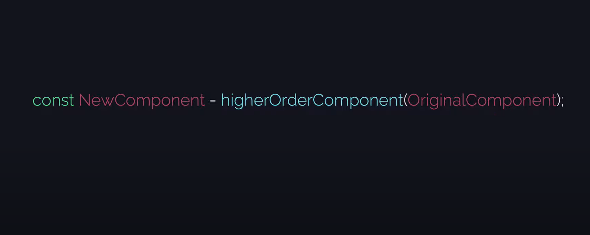

# Higher Order Component






---

## App.js

```js
function App() {

    return (
        <div>
            <h1>HOC</h1>
            <ClickComponent></ClickComponent>
            <HoverComponent></HoverComponent>
        </div>
    );
}
```

---

## withCounter.js

```js
const withCounter = (OriginalComponent) => {
    class NewComponent extends React.Component {
        state = {
            count: 0
        }

        handleIncrement = () => {
            this.setState(prevState => {
                return {count: prevState.count + 1};
            })
        }

        render() {
            const {count} = this.state;

            return (
                <OriginalComponent
                    count={count}
                    handleIncrement={this.handleIncrement}
                />
            )
        }
    }

    return NewComponent;
}
```
Notes:
- HOC file er naam *with* diye shuru hoy
- HOC ekta 'component' param hishebe nei, like `OriginalComponent`
- HOC return-o kore arekta 'component', like `NewComponent`
- amader ei *HOC* ta param hishebe j component ta pacche, taar shathe *duita **props*** add kore diye new component banacche
- ete kore amader new component ta, *state* ebong ekta *method* er access pacche

---

## ClickComponent.js

```js
class ClickComponent extends React.Component {
    
    render() {
        const {count,handleIncrement} = this.props;
        return (
            <div>
                <button onClick={handleIncrement}>Clicked {count} times</button>
            </div>
        );
    }
};
```

---

## HoverComponent.js

```js
class HoverComponent extends React.Component {

    render() {
        const {count,handleIncrement} = this.props;

        const myStyle = {
            display:"inline",
            maxWidth:"fitContent",
            color: "red"
        }

        return (
            <div>
                <h2 style={myStyle} onMouseEnter={handleIncrement}>Entered {count} times</h2>
            </div>
        );
    }
};
```