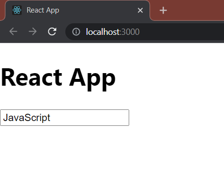
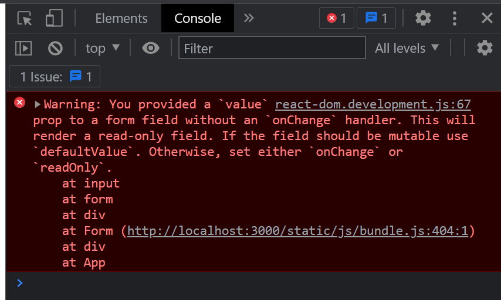

```js
import React, {Component} from 'react';

class Form extends Component {
    render() {
        return (
            <div>
                <form>
                    <input 
                        type="text" 
                        placeholder='Enter title' 
                        value='JavaScript'
                    />
                </form>
            </div>
        );
    }
}

export default Form;
```

uporer code er output ashe eta:

amra ei khetre `input` field a kichu r likhte partesi na

`JavaScript` value ta ekdom *fixed* hoye ase



plus *colsole* open korle amra ei *warning* ta dekhte pabo:



---

## How to solve this ?

- we need to add an `onChange` inside ouy `input` field
- we need to have a **state** to run all this smoothly


```js
class Form extends Component {
    state =
        {
            title: ''
        }
}
```

```js
class Form extends Component {
    handleChange = (e) => {
        this.setState({title:e.target.value});
    }
}
```

```js
class Form extends Component {
    render() {
        return (
            <form>
                <input
                    type="text"
                    placeholder='Enter title'
                    value={this.state.title}
                    onChange={this.handleChange} 
                />
            </form>
        );
    }
}
```