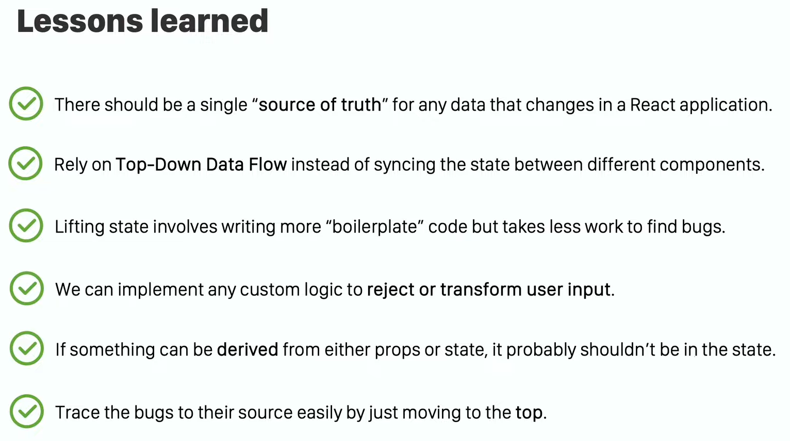

# Lifting State Up

### React JS এ বিভিন্ন component কে একই changing data নিয়ে কাজ করতে হয় এবং সেই data change হলে সেই পরিবর্তন কে reflect করতে হয়। এই ক্ষেত্রে React Team recommend করে shared state কে component গুলোর নিকটবর্তী *common ancestor* এর কাছ থেকে নিয়ে আসা। এটা React এর খুবই common একটা pattern. এটা করলে সব component এর জন্য একটা “single source of truth” ensured হয় এবং React এর বিখ্যাত “Top Down Approach” অথবা “Uni-directional Data Flow” - এর মাধ্যমে খুব সুন্দর ভাবে স্বল্প সংখ্যক Stateful component এবং সর্বাধিক presentational component এর মাধ্যমে পুরো application এর component গুলোকে loosely coupled রাখা যায়।

### এই [video](https://youtu.be/v7UpjUQJjWY) তে আমি React এর documentation follow করে উদাহরণের মাধ্যমে এই বিষয়টি বুঝিয়ে বলার চেষ্টা করেছি। আশা করি beginners দের উপকারে আসবে।

---
 

